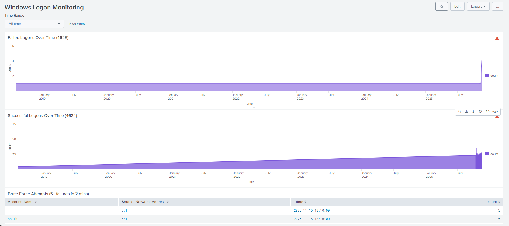
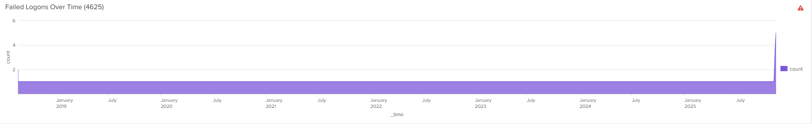
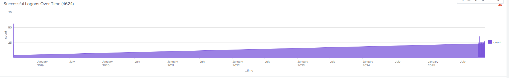

# 🟣 Windows Logon Monitoring — Splunk Dashboard  
A real-time monitoring dashboard for Windows Security Logon events using Splunk.  
This project helps visualize successful logons, failed logons, and detect brute-force attack attempts using Windows Security Event Logs (4624 & 4625).

---

## 📌 Features  
✔️ Monitor failed logon events (4625)  
✔️ Visualize successful logons (4624)  
✔️ Detect brute-force attempts automatically  
✔️ Easy-to-import Splunk XML dashboard  
✔️ Includes all SPL queries  
✔️ Lightweight and ideal for SOC, Blue Teams, & Home Labs  

---
## 📊 Dashboard Preview

### Dashboard Overview  


### Failed Logons Chart  


### Successful Logons Chart  


### Brute force event  


---

## 🧠 SPL Queries

### 🔹 Failed Logons Over Time (4625)
```spl
index=* sourcetype=WinEventLog:Security EventCode=4625
| timechart span=1m count
```
### 🔹 Successful Logons Over Time (4624)
```spl
index=* sourcetype=WinEventLog:Security EventCode=4624
| timechart span=1m count
```
### 🔥 Brute Force Detection (5+ failures in 2 mins)
```spl
index=* sourcetype=WinEventLog:Security EventCode=4625
| bin _time span=2m
| stats count by Account_Name, Source_Network_Address, _time
| where count >= 5
| sort - count
```
### 🛡️ Use Cases

1.SOC Analyst / Blue Team lab

2.Detect password spraying / brute-force attacks

3.Monitor compromised accounts

4.dows security visibility for training


####👨‍💻 Author

Sathish
SOC Analyst | Cybersecurity Enthusiast

